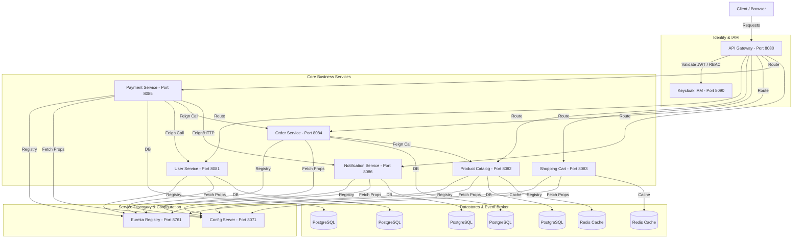
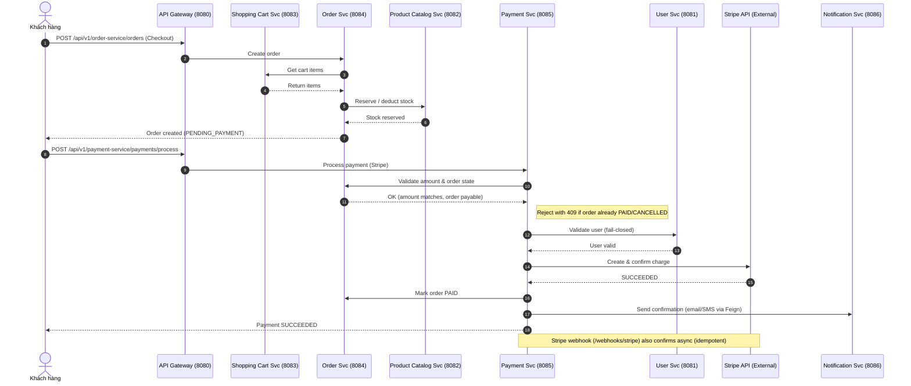
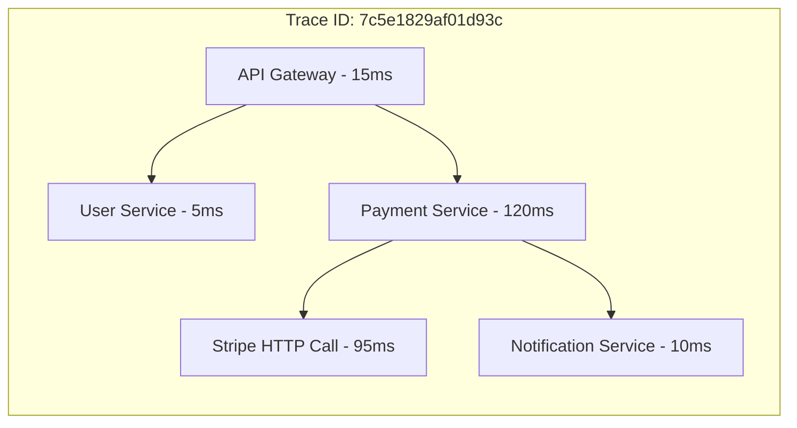

# E-commerce Microservices Platform

[](https://github.com/hmonster013/ecommerce-microservice/actions/workflows/ci.yml)

> **Project URL**: https://roadmap.sh/projects/scalable-ecommerce-platform

A scalable e-commerce platform built with microservices architecture using Spring Boot, Spring Cloud, and Docker.

## 📖 Docs

- [Architecture overview (tiếng Việt)](docs/architecture.md) — sơ đồ tổng thể, vai trò service, luồng auth, lưu ý maintenance.

## 🏗️ Architecture

### 1. Sơ đồ hệ thống (System Architecture)



### 2. Luồng nghiệp vụ cốt lõi - Golden Path (Order & Checkout Sequence)



### 3. Sơ đồ mô phỏng Tracing (Trace-to-Logs with Grafana & Tempo)



### Microservices
- **API Gateway** (8080) - Single entry point with OAuth2 authentication
- **User Service** (8081) - User profile management
- **Product Catalog** (8082) - Product and inventory management
- **Shopping Cart** (8083) - Shopping cart operations
- **Order Service** (8084) - Order processing
- **Payment Service** (8085) - Payment processing with Stripe integration
- **Notification Service** (8086) - Email/SMS notifications

### Infrastructure
- **Keycloak** (8090) - Identity and access management (OAuth2/OIDC)
- **Eureka Server** (8761) - Service discovery
- **Config Server** (8071) - Centralized configuration
- **PostgreSQL** (5432) - Primary database (database-per-service)
- **Redis** (6379) - Caching layer
- **RabbitMQ** (5672, 15672) - Message broker
- **Kafka** (9092) - Event streaming

### Observability Stack
- **Grafana** (3000) - Dashboards and visualization
- **Loki** (3100) - Log aggregation
- **Prometheus** (9090) - Metrics collection
- **Tempo** (3200, 4317, 4318) - Distributed tracing
- **OpenTelemetry Java Agent** - Automatic instrumentation

## 🚀 Quick Start & 1-Command Demo

### Prerequisites
- Docker & Docker Compose
- Java 17+ (Microsoft OpenJDK / Temurin recommended) và Maven 3.6+

### 🛠️ Khởi động full-stack (toàn bộ hạ tầng + 8 microservices)

Chạy toàn bộ hệ thống (hạ tầng database, caching, IAM, message broker, observability stack và **tất cả 8 microservices**) từ thư mục root. Image của prod copy sẵn jar đã build (`COPY target/*.jar`), nên **phải build jar trước** rồi mới build image:

```bash
# 1) Build tất cả jar (chạy từ root)
./mvnw clean package -DskipTests

# 2) Build image & chạy toàn bộ stack
docker compose -p prod --env-file .env.prod -f docker/prod/docker-compose.yml up -d --build
```

### Run Profiles

Hệ thống hỗ trợ 2 profile chạy linh hoạt:

- **`docker/default/` (Infrastructure-only local development)**: Chỉ chạy **hạ tầng** (PostgreSQL, Redis, RabbitMQ, Kafka, Keycloak, Eureka, Config Server, và Observability Stack). Các business services sẽ chạy trực tiếp trên máy của bạn (qua IntelliJ IDEA / Eclipse hoặc dòng lệnh) để phục vụ debug nhanh.
  ```bash
  docker compose --env-file .env -f docker/default/docker-compose.yml up -d
  # Sau đó chạy các services mong muốn qua IntelliJ hoặc Maven wrapper:
  $env:JAVA_HOME="<path-to-jdk-17>"; .\mvnw.cmd -pl order-service spring-boot:run
  ```
- **`docker/prod/` (Full Containerized Production-like environment)**: Đóng gói và chạy **toàn bộ** hệ thống trong Docker containers (như mục khởi động full-stack ở trên), dùng file `.env.prod`.

*Lưu ý: Mọi lệnh Docker Compose phải chạy tại root project và truyền env qua `--env-file` (`.env` cho `docker/default`, `.env.prod` cho `docker/prod`) để tránh lỗi biến môi trường trống.*

### Access Services
- **API Gateway**: http://localhost:8080
- **Keycloak Admin Console**: http://localhost:8090/admin (admin/admin)
- **Eureka Dashboard**: http://localhost:8761
- **Grafana**: http://localhost:3000 (anonymous access enabled)
- **Prometheus**: http://localhost:9090
- **RabbitMQ Management**: http://localhost:15672 (user/password)

### Verify System Health
```bash
curl http://localhost:8080/actuator/health
```

## 📚 API Documentation

### Swagger UI
- **API Gateway (Aggregated)**: http://localhost:8080/swagger-ui.html
- Individual services: `http://localhost:{port}/swagger-ui.html`

### OpenAPI Specification
- `http://localhost:{port}/v1/api-docs`

## 📊 Monitoring & Observability

### Grafana Dashboards
Access Grafana at http://localhost:3000 (no login required)

**Pre-configured Data Sources:**
- **Loki** - Centralized logging with trace correlation
- **Prometheus** - Metrics and monitoring
- **Tempo** - Distributed tracing

**Features:**
- Trace-to-logs correlation via derived fields
- Service map and dependency graph
- Real-time metrics dashboards
- Log aggregation across all services

### OpenTelemetry Integration
All services are instrumented with OpenTelemetry Java Agent for:
- Automatic trace propagation
- Metrics export to Prometheus
- Trace export to Tempo
- Log correlation with trace IDs

**Log Format:**
```
2025-11-07 07:24:58.551 [service-name] [trace_id,span_id] -LEVEL ...
```

## 🛠️ Technology Stack

### Core
- **Spring Boot 3.2.5** - Application framework
- **Spring Cloud 2023.0.1** - Microservices ecosystem
- **Keycloak** - OAuth2/OIDC authentication & authorization
- **Spring Security OAuth2** - Resource server integration
- **Spring Data JPA** - Data access
- **PostgreSQL 15** - Relational database
- **Redis 7** - Caching layer
- **RabbitMQ 3.13** - Message broker
- **Apache Kafka 3.7** - Event streaming

### Observability
- **Grafana** - Visualization
- **Loki** - Log aggregation
- **Prometheus** - Metrics
- **Tempo** - Distributed tracing
- **OpenTelemetry** - Instrumentation
- **Grafana Alloy** - Telemetry collector

### Infrastructure
- **Netflix Eureka** - Service discovery
- **Spring Cloud Config** - Configuration management
- **Spring Cloud Gateway** - API gateway
- **Docker & Docker Compose** - Containerization

## 🔧 Configuration

Configuration is managed through:
- **Spring Cloud Config Server** - Centralized configuration (Git-based)
- **Environment Variables** - Runtime configuration via `.env` files
- **Application Properties** - Service-specific settings

Environment file:
- `.env` (root project) — nguồn duy nhất cho cả local dev và Docker. Truyền qua `--env-file .env` khi gọi `docker compose`.

## 🔐 Security

- **Keycloak OAuth2/OIDC** - Enterprise-grade authentication server
- **JWT Token-Based Auth** - Access tokens with refresh mechanism
- **API Gateway Security** - Centralized authentication/authorization
- **Role-Based Access Control (RBAC)** - Multiple roles (ADMIN, CUSTOMER, MANAGER, SUPPORT)
- **User Sync** - Automatic synchronization between Keycloak and User Service
- **Rate Limiting** - API Gateway level rate limiting
- **Password Policy** - Managed by Keycloak

### Authentication Endpoints
- `POST /api/auth/register` - User registration
- `POST /api/auth/login` - User login
- `POST /api/auth/refresh` - Token refresh
- `POST /api/auth/logout` - User logout

See [AUTHENTICATION_TEST_GUIDE.md](AUTHENTICATION_TEST_GUIDE.md) for detailed testing guide.

## 📈 Key Features

- **Database per Service** - Independent data management
- **Service Discovery** - Automatic service registration with Eureka
- **Configuration Management** - Centralized with Spring Cloud Config
- **API Gateway** - Single entry point with routing and security
- **Distributed Tracing** - Full request tracing across services
- **Log Correlation** - Trace ID in every log entry
- **Health Checks** - Kubernetes-ready health endpoints
- **Resilience4j** - Circuit breaker pattern for fault tolerance
- **Event-Driven** - Kafka for async communication
- **Caching** - Redis for performance optimization

## 🚀 Development

### Build Services
```bash
mvn clean package -DskipTests
```

### Run Locally
```bash
# Start full infrastructure (from project root)
docker compose --env-file .env -f docker/default/docker-compose.yml up -d

# Run business service from IntelliJ, or via mvn:
cd user-service
mvn spring-boot:run
```

`docker/default/` chỉ chứa hạ tầng — business service chạy ngoài Docker (IntelliJ / mvn). Khi cần chạy full Docker (production-like), dùng `docker/prod/`.

### Environment Variables
File `.env` nằm ở **root project** và là nguồn duy nhất. Mọi lệnh `docker compose` phải kèm `--env-file .env` (chạy từ root), nếu không biến sẽ rỗng và service start fail.

## 📝 Project Structure

```
ecommerce-microservice/
├── api-gateway/               # API Gateway with security
├── config-server/            # Configuration server
├── eureka-server/            # Service registry
├── user-service/             # User & auth management
├── product-catalog-service/  # Product management
├── shopping-cart-service/    # Shopping cart
├── order-service/            # Order processing
├── payment-service/          # Payment with Stripe
├── notification-service/     # Email/SMS notifications
├── docker/
│   ├── default/              # Local dev: infrastructure only (business svc chạy IntelliJ)
│   ├── prod/                 # Production: full Docker (infra + business services)
│   └── observability/        # Monitoring configs
└── .env                      # Env vars (root) — dùng với --env-file
```

## 📄 License

This project is open source and available under the [MIT License](LICENSE).
