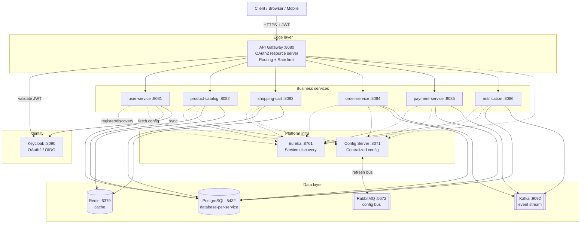
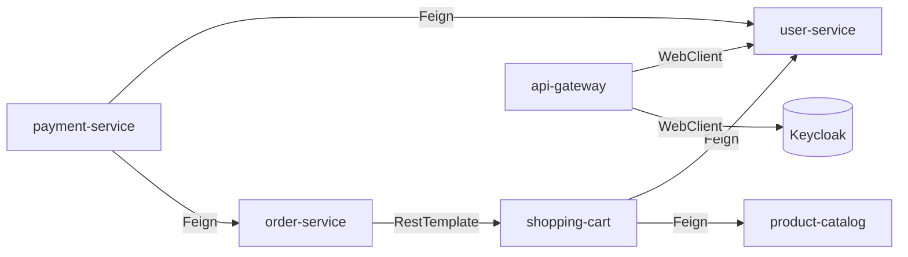
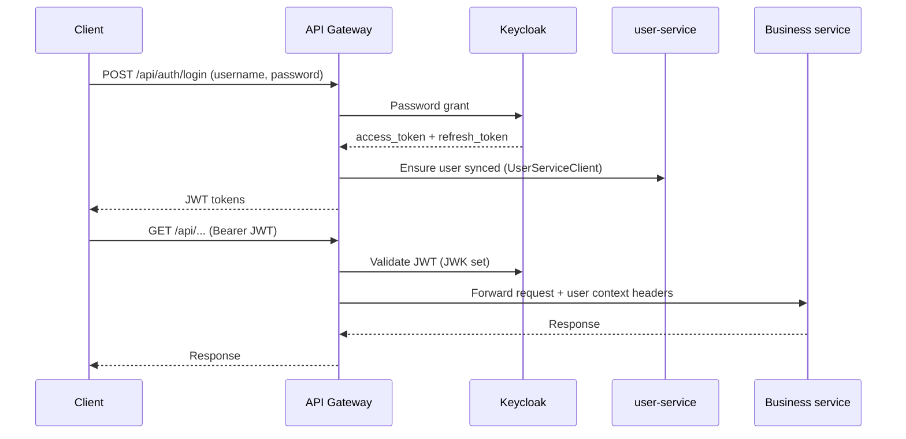

# Kiến trúc tổng quan — E-commerce Microservices

Tài liệu này mô tả bức tranh tổng thể của hệ thống: các service, cách chúng giao tiếp, và vai trò của từng thành phần hạ tầng. Dùng làm điểm khởi đầu khi quay lại project sau một thời gian không động đến.

> Stack chính: Spring Boot 3.2.5, Spring Cloud 2023.0.1, Java 17, PostgreSQL 15, Redis 7, RabbitMQ 3.13, Kafka 3.7, Keycloak, Docker Compose.

---

## 1. Bố cục module (Maven multi-module)

Project là một parent POM (`org.de013:ecommerce-microservice`) gom các module độc lập. `common` build trước vì các service khác phụ thuộc vào nó.

```
ecommerce-microservice/
├── common/                     # DTO, exception, security context, constants dùng chung
├── eureka-server/              # Service registry (port 8761)
├── config-server/              # Centralized config (port 8071) — refresh qua RabbitMQ bus
├── api-gateway/                # Single entry point (port 8080) — auth, routing, rate limit
├── user-service/               # 8081 — user profile, sync với Keycloak
├── product-catalog-service/    # 8082 — product, inventory
├── shopping-cart-service/      # 8083 — cart, Redis cache
├── order-service/              # 8084 — order processing
├── payment-service/            # 8085 — Stripe integration
├── notification-service/       # 8086 — email/SMS
├── docker/             # default/, observability/, prod/
├── kubernetes/                 # K8s manifests
└── docs/                       # Tài liệu (file này nằm đây)
```

`common` chỉ chứa thứ thực sự dùng chéo: `ApiResponse`, `ErrorResponse`, `GlobalExceptionHandler`, `BusinessException`, `UserContext`, `AuthorizationHelper`, `ApiPaths`, `JCode`. Không đặt domain logic vào đây.

---

## 2. Sơ đồ tổng thể



Quy ước trong diagram:
- Mũi tên nét liền = call đồng bộ (HTTP/JWT).
- Mũi tên nét đứt = đăng ký / fetch config / refresh bus.
- Hộp `[[...]]` = message broker, `[(...)]` = data store.

---

## 3. Vai trò từng thành phần

### 3.1 Hạ tầng (infrastructure)

| Service | Port | Vai trò |
|---|---|---|
| **Eureka Server** | 8761 | Tất cả service đăng ký vào đây. Client-side load balancing thông qua tên service (vd `user-service`). |
| **Config Server** | 8071 | Lấy config từ Git, phục vụ qua HTTP. Khi config thay đổi, dùng RabbitMQ bus để broadcast `/actuator/busrefresh`. |
| **API Gateway** | 8080 | Single entry point. Validate JWT (Keycloak), route theo path, rate limit. Cũng host endpoint `/api/auth/*` (login/register/refresh/logout) — proxy qua `KeycloakService` và `UserServiceClient`. |
| **Keycloak** | 8090 | OAuth2/OIDC provider. Quản lý user, roles (ADMIN/CUSTOMER/MANAGER/SUPPORT), password policy. `user-service` sync user từ Keycloak về DB nội bộ. |

### 3.2 Business services

| Service | Port | Trách nhiệm chính | Phụ thuộc |
|---|---|---|---|
| **user-service** | 8081 | User profile, đồng bộ với Keycloak | Postgres, Keycloak |
| **product-catalog** | 8082 | Sản phẩm, danh mục, inventory | Postgres, Redis |
| **shopping-cart** | 8083 | Giỏ hàng | Postgres, Redis, user-service, product-catalog |
| **order-service** | 8084 | Tạo & xử lý order | Postgres, shopping-cart, Kafka |
| **payment-service** | 8085 | Thanh toán qua Stripe | Postgres, user-service, order-service, Kafka |
| **notification** | 8086 | Email/SMS | Kafka (consumer) |

### 3.3 Data & messaging

- **PostgreSQL** — database-per-service: mỗi service một schema/DB riêng, không chia sẻ bảng. Script khởi tạo ở `init-databases.sql`.
- **Redis** — cache cho product catalog và session/cart.
- **RabbitMQ** — **chỉ dùng cho Spring Cloud Config bus** (refresh config). Không phải broker cho business event.
- **Kafka** — event streaming cho luồng order → payment → notification (async).

---

## 4. Giao tiếp giữa các service

Có 3 kiểu giao tiếp đang dùng:

### 4.1 Synchronous — Feign / RestTemplate / WebClient

Dùng khi cần dữ liệu ngay (vd. cart cần thông tin product, payment cần thông tin order). Đều đi qua **Eureka service name**, không hardcode host.



Quy ước hiện tại (chưa chuẩn hóa — cần để ý):
- `shopping-cart-service` và `payment-service` dùng **Feign** + fallback class (resilience).
- `order-service` và `shopping-cart-service` còn có chỗ dùng **RestTemplate** trực tiếp.
- `api-gateway` dùng **WebClient** (reactive).

> **TODO maintenance**: cân nhắc thống nhất sang Feign + Resilience4j cho mọi service-to-service call để dễ apply circuit breaker đồng bộ.

### 4.2 Asynchronous — Kafka

Order/Payment phát event, Notification consume. Mỗi service tự quản lý topic của mình; xem `application.yml` của từng service để biết tên topic cụ thể.

### 4.3 Config refresh — RabbitMQ bus

Khi đẩy config mới lên Git, gọi `POST /actuator/busrefresh` ở bất kỳ service nào → bus broadcast → tất cả service reload mà không cần restart.

---

## 5. Luồng authentication



- Gateway là nơi duy nhất nói chuyện với Keycloak ở edge. Các business service nhận **JWT đã được validate**, đọc user info qua `UserContext` / `UserContextHolder` ở `common`.
- `AuthorizationHelper` (trong `common/security/`) là chỗ check role tập trung — dùng nó thay vì viết `hasRole(...)` rải rác.

---

## 6. Observability

Stack: **OpenTelemetry agent** → **Tempo** (trace) + **Prometheus** (metrics) + **Loki** (log), tất cả render trong **Grafana**.

- Mọi service chạy kèm OTel Java Agent → tự động trace HTTP, JDBC, Kafka.
- Log format chuẩn: `timestamp [service-name] [trace_id,span_id] -LEVEL ...` → Loki dùng `trace_id` để jump sang Tempo (derived fields đã cấu hình sẵn).
- Compose riêng cho observability: `docker/observability/`.

---

## 7. Cách chạy

Có 2 profile compose, dùng cho 2 mục đích khác nhau. **File `.env` chỉ nằm ở root project**, nên mọi lệnh `docker compose` phải kèm `--env-file .env` (chạy từ root).

### 7.1 Local development — `docker/default/`

Compose này **chỉ chứa hạ tầng** (Postgres, Redis, RabbitMQ, Kafka, Keycloak, Eureka, Config Server, observability stack). Các business service (user, product, cart, order, payment, notification) sẽ chạy **trực tiếp trên IntelliJ** để dễ debug, hot-reload, gắn breakpoint.

```bash
# Từ root project — start toàn bộ hạ tầng
docker compose --env-file .env -f docker/default/docker-compose.yml up -d

# Sau đó mở IntelliJ và Run từng business service (hoặc dùng mvn)
cd user-service && mvn spring-boot:run
```

Lưu ý khi chạy service từ IntelliJ:
- Service kết nối tới hạ tầng qua `localhost:<port>` (Postgres 5432, Redis 6379, …) — vì IntelliJ chạy ngoài Docker network.
- Eureka URL: `http://localhost:8761/eureka/`.
- Config Server URL: `http://localhost:8071`.
- Keycloak issuer: `http://localhost:8090/realms/<realm>`.
- Dùng Spring profile `dev` (hoặc tương đương) nếu code có phân biệt — để load đúng endpoint `localhost`.

### 7.2 Production / full Docker — `docker/prod/`

Compose này build và chạy **toàn bộ stack trong Docker** (hạ tầng + tất cả business service), dùng cho môi trường gần production hoặc khi muốn demo end-to-end mà không cần IDE.

```bash
# Từ root project — build images + start full stack
docker compose --env-file .env -f docker/prod/docker-compose.yml up -d --build

# Dừng & xoá
docker compose --env-file .env -f docker/prod/docker-compose.yml down
```

Khác biệt chính so với `default/`:
- Có thêm service block cho từng business service (image build từ Dockerfile của module).
- Service-to-service URL dùng **hostname container** (vd `http://eureka-server:8761`, `http://keycloak:8090`) — không phải `localhost`.
- Spring profile thường set là `docker` hoặc `prod`.
- Resource limit (cpu/memory) và restart policy được tighten lại.
- Log driver có thể trỏ thẳng vào Loki/Alloy.

> Lưu ý: nếu folder `docker/prod/` đang trống, file compose cần được tạo dựa trên `default/docker-compose.yml` + thêm service block cho từng module (xem Dockerfile trong từng service).

Endpoint kiểm tra nhanh:
- Gateway health: <http://localhost:8080/actuator/health>
- Eureka dashboard: <http://localhost:8761>
- Keycloak admin: <http://localhost:8090/admin> (admin/admin)
- Grafana: <http://localhost:3000>
- Swagger aggregate: <http://localhost:8080/swagger-ui.html>

---

## 8. Những điểm dễ quên khi quay lại sau

1. **Build `common` trước** — các service khác sẽ fail nếu `common` chưa được install vào local repo.
2. **Eureka name là contract**: đổi `spring.application.name` ở một service sẽ phá Feign client ở service khác.
3. **RabbitMQ ở đây KHÔNG phải business broker** — chỉ dùng cho config bus. Đừng nhầm với Kafka.
4. **Database-per-service**: không join bảng giữa các service. Cần data của service khác → gọi API hoặc consume event.
5. **JWT chỉ validate ở Gateway** — business service tin JWT đã sạch và đọc claim qua `UserContext`. Đừng expose service ra ngoài Gateway.
6. **Config thay đổi** thì không cần restart — push lên Git rồi `POST /actuator/busrefresh`.
7. **`.env` chỉ nằm ở root project** — không còn copy vào `docker/*/`. Mọi lệnh `docker compose` phải kèm `--env-file .env` (chạy từ root), nếu không các biến môi trường sẽ rỗng và service start fail.
8. **Hai profile compose khác mục đích**: `default/` = chỉ hạ tầng cho local dev (business service chạy IntelliJ), `prod/` = full Docker. Đừng nhầm — chạy nhầm `default/` mà mong có business service sẽ thấy Gateway không tìm được service.
9. **Service-to-service client chưa thống nhất** (Feign vs RestTemplate vs WebClient) — khi đụng vào, ưu tiên Feign + fallback.

---

## 9. Mở rộng tài liệu

Khi cần đào sâu, tách thành các file riêng trong `docs/`:
- `docs/services/<service-name>.md` — chi tiết từng service (endpoints, schema, events).
- `docs/setup.md` — hướng dẫn build/run đầy đủ + troubleshooting.
- `docs/api.md` — tổng hợp endpoint (có thể generate từ `full_endpoint_test_results.csv`).
- `docs/events.md` — danh sách Kafka topic + schema payload.
